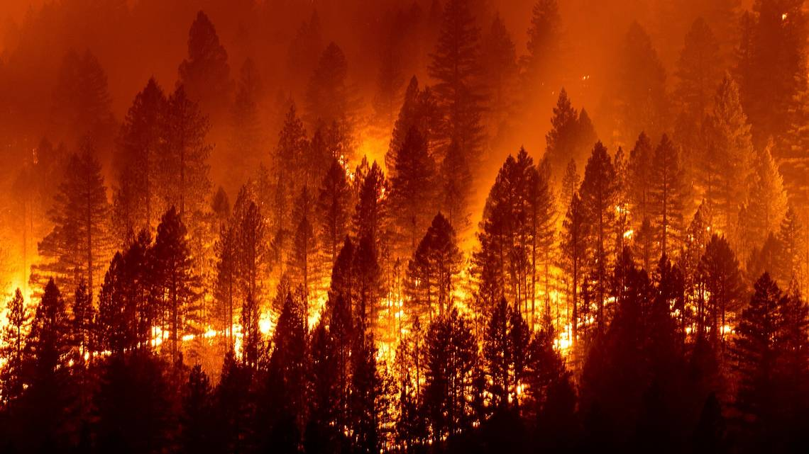
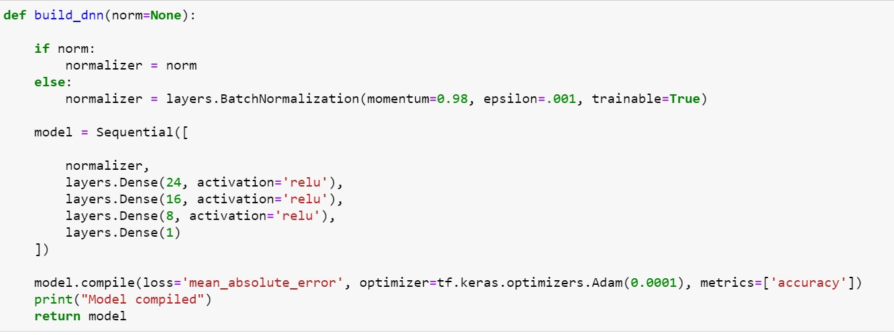

# California Wildfires Analysis

    

## Topic
The focus of this project will be on California wildfires.

## Why Wildfires?
This topic was chosen to gauge what we may experience in the next upcoming fire season. As the summer comes to a close, it's important to analyze the past fire data and current precipitation measurements and temperature to get a hollistic view of what we may experience in the next upcoming fire season.

## High-Level Overview
Our goal is to first determine the most susceptible wildfire areas by looking at the largest fires in recent years. From these data, we can see that there are some areas that are more susceptible to fire danger. In these areas, it's important to share fire awareness. Everyone needs to understand that it's a communal effort that makes a difference.  It's really important to clear out dead leaves and brush, for example. Another idea is to make sure campfires are put out properly.  These are simple yet necessary ideas on prevention. Unfortunately, there are always some unexpected incidents that may arise, for example, the lighting fireworks and random lightning strikes. However, in looking at the data, we can utilize a model to help predict if/when our next fires may occur. This way firefighters can take a more proactive approach in combating issues that may occur.

## Description of Source Data
Some of the variables that can cause fires include weather patterns, fuel/environmental factors, drought/water levels, the number of fire stations/resources available in each county and each year at the time of an incident, and preventative measures.

## Questions We Hope to Answer
- When and where could the next California wildfire be?
- How does temperature play a role in fire season?
- Are there specific counties that are more prone to wildfires?
- What's the main factor to cause a wildfire?

## Datasets
[Kaggle Wildfire Data (2013-2020)](https://www.kaggle.com/ananthu017/california-wildfire-incidents-20132020) 
The above link has a dataset that contains geographical information such as latitude and longitude, county, acres burned, [fire] engines, start and extinguished dates,etc.

[Precipitation and Temperature Data (1901-2021)](https://www.ncdc.noaa.gov/cag/county/mapping/4/pcp/201902/1/value) 
The hyperlink above includes a dataset on monthly precipitation as well as mean/min/max temperature data.

## Team Member Roles
There were four roles to be assumed by the members of our group, which was comprised of 5 members -- Jinfang Li, Wendy Mudzinski, Stephen Tan, Rachel Tsuchiyama, and Cassie Xu. The roles and descriptions for this project are:

**Week One**
- **Square** - *The team member in the square role will be responsible for the repository.*
    - Stephen
- **Triangle** - *Transform the mockup database into a full database that integrates with your work*
    - Rachel,Cassie
- **Circle** - *creates mockup of a database with a set of sample data*
    - Jinfang, Wendy
- **X** - *decides which technologies to use for each step of the project* 
    - No one assumed this role since we all contributed equally

**Week Two**
- **Square** - *Refine the machine learning model you'll be using (train and test).*
    - Cassie
- **Triangle** - *Transform the mockup database into a full database that integrates with your work.*
    - Rachel
- **Circle** - *Continue with analysis and create visuals to accompany the data story.*
    - Stephen
- **X** - *Outline and begin work on a dashboard to house your final project. Check and test the work completed against the rubric* 
    - Wendy, Jinfang
    
 **Week Three**
- **Square** - *Complete peer reviews on the code*
    - Cassie
- **Triangle** - *Create a draft presentation to share with your class*
    - Rachel
- **Circle** - *Create a dashboard to display your findings*
    - Stephen
- **X** - *Perform a quality assurance check on project deliverables against rubric requirements, and test the code.* 
    - Wendy, Jinfang
----------

## Database
A provisional database was created that includes sample data that mimics the expected final database schema and is tied to our draft machine learning model. The image below shows the initial dataframe that was created with the cleaned Kaggle Wildfires (2013-2020) dataset.

## Machine Learning Model
**Week One**

The provisional machine learning model (*as shown in* fire_analysis.ipynb) that we created is a draft for the final machine learning model. This provisional model (1) takes in data from the provisional database, which includes data from the Kaggle Wildfires (2013-2020) dataset shown above and (2) outputs county labels for the wildfire input data sourced from our datasets. The trained model came out at 98.31% accuracy.

**Week Two**

### Preliminary data preprocessing

- Encoding text labels into numerical values using pd.get_dummies() for "county" columns.

 Machine learning algorithms typically only work with numerical data. Categorical and text data must therefore be converted to numerical data for use.
 We will split county column into two columns. If county belong to the specific county, the column will read 1; for the rest of the counties, the column will read 0.
(or we can cretae a dictionary of the county in the California and apply a custom function to convert the county names to their corresponding integers by using label_encoder and Lambda function.)
 
- Scaling or normalizing data is another preprocessing step by using Scikit-learn's StandardScaler module.

The model -> fit -> predict/transform workflow is also used when scaling data. The standard scaler standardizes the data. This means that each feature will be rescaled so that its mean is 0 and its standard deviation is 1, which will reduce the likeligood that large values will unduly influence the model.

### Preliminary feature engineering and preliminary feature selection, including the decision-making process

- Preliminary feature engineering: Transformation DataFrame.
- Preliminary feature selection: Drop the Location ID because they are just identified ID without useful information.

### Description of how data was split into training and testing sets
Train_test_split() function has been executed and the data is split into a 75-25 split of the original data set. By default, our training and testig data sets are 75% and 25%.

### Explanation of model choice, including limitations and benefits
A multi-layer neural network contains more than one 

- Benefits of Multiple Neuron Neural Network to add neurons to the hidden layers: 
There is a distributed effort to find optimal weights—faster. Each neuron can focus on different features to identify nonlinear effects—smarter. It is less likely to fixate on complex variables—more robust.

- Limitation of Multiple Neuron Neural Network:
The neurons to our neural network model can't been always use the maximum number because Overfitting and computation resurces. Additionally, a neural network model with a large number of neurons requires equally large training dataset—training a large neural network requires more data, more epochs, and more time.

**Week Three**
- Explanation of changes in model choice (if changes occurred between the Segment 2 and Segment 3 deliverables)
- Description of how they have trained the model thus far, and any additional training that will take place
- Description of current accuracy score

**Week Four**
- Description of data preprocessing
- Description of feature engineering and the feature selection, including the decision-making process
- Description of how data was split into training and testing sets
- Explanation of model choice, including limitations and benefits
- Explanation of changes in model choice (if changes occurred between the Segment 2 and Segment 3 deliverables)
- Description of how the model was trained (or retrained, if the team is using an existing model)
- Description and explanation of model's confusion matrix, including final accuracy score
The final loss is 79% and accuracy is 87%.
